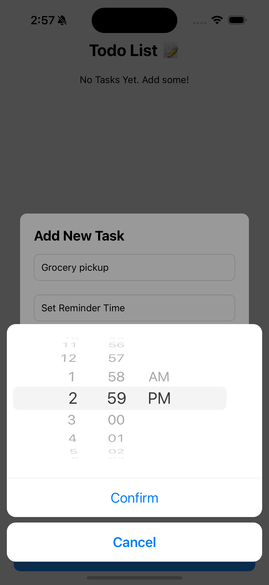
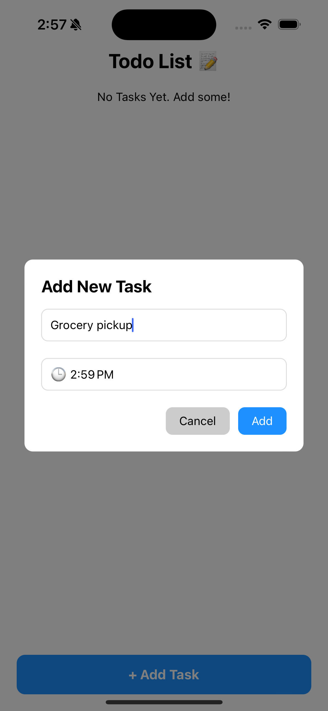
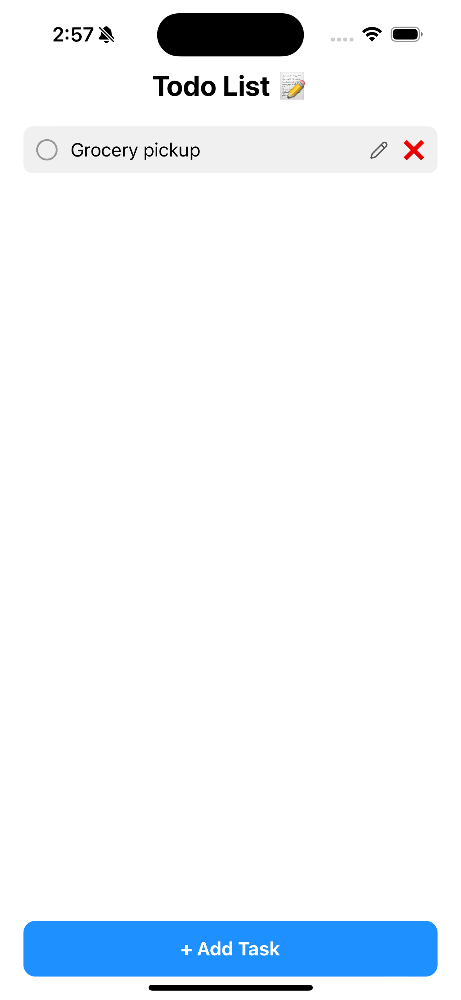
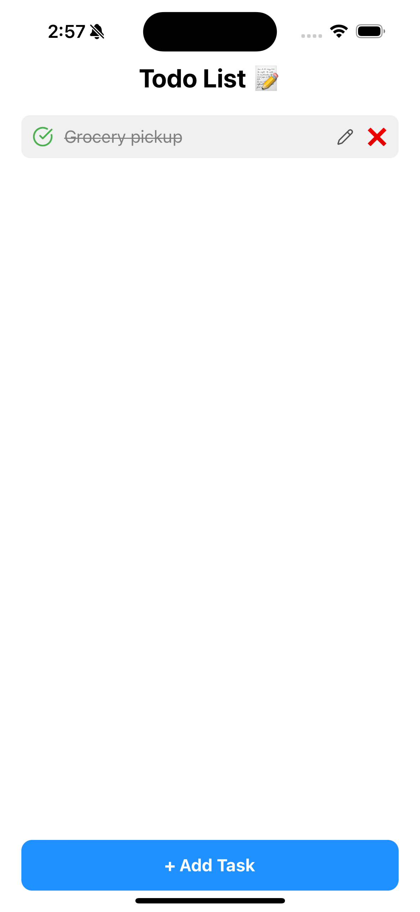
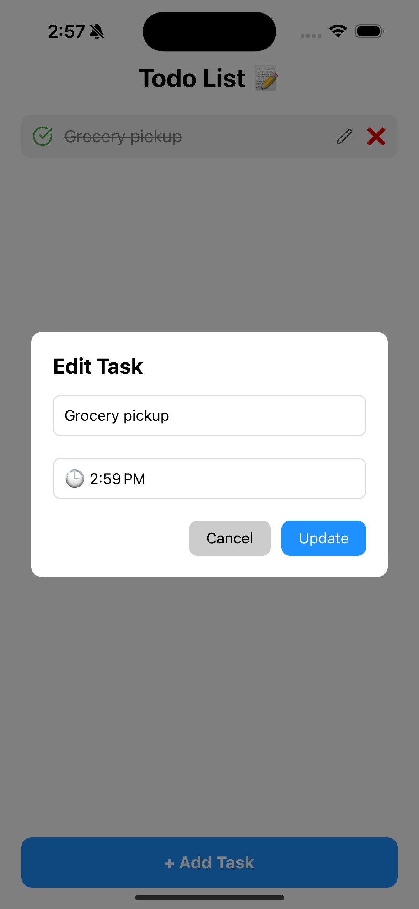
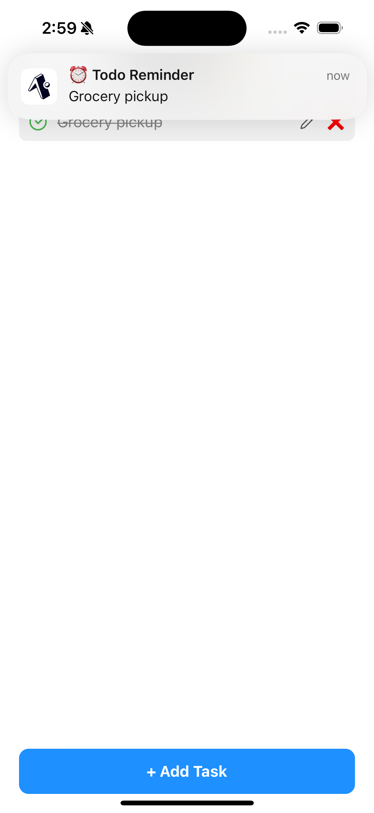

# 📝 React Native Todo App with Daily Reminders

A clean and scalable **React Native Todo App** built with **Expo**, featuring:

- 🧾 Task creation and editing  
- ⏰ Daily reminder notifications  
- 📅 Time selection using `react-native-modal-datetime-picker`  
- 🔔 Scheduled local notifications via `expo-notifications`  
- 🧠 Clean modular architecture & reusable components  

---

## 📱 Demo
+You can test the app live using Expo Go:
+
+- Android: Scan the QR code in terminal
+- iOS: Open the project in Expo Go via email or link
+
+> You must have [Expo Go](https://expo.dev/client) installed on your device.


## 📱 Screenshots

### ➕ Add ,Schedule And Edit Task


<table>
  <tr>
    <td></td>
    <td></td>
    <td></td>
  </tr>
  <tr>
    <td></td>
    <td></td>
    <td></td>
  </tr>
  <tr>
    <td></td>
  </tr>
</table>


---

## 🚀 Features

- ✅ Create, update, and manage todos using live firestore.
- ✅ Set **daily** time-based reminders for tasks  
- ✅ Notifications fire daily at the selected time  
- ✅ Persistent storage with `AsyncStorage`  
- ✅ Clean and minimal UI  
- ✅ Built with **Expo**, runs on both Android & iOS  

---

## 📦 Tech Stack

| Tech                                      | Purpose                        |
|-------------------------------------------|--------------------------------|
| **React Native + Expo**                   | App framework & tooling        |
| `expo-notifications`                      | Local notifications            |
| `@react-native-async-storage/async-storage` | Persistent key-value storage   |
| `react-native-modal-datetime-picker`      | Time picker UI                 |
| `@react-native-community/datetimepicker`  | Base datetime picker           |
| `@firebase`                               | Firebase integration for firestore |


---
## 🧠 Approach

The app uses:

- **Forwarded Refs** to control modals externally (add/edit tasks)
- **Local component state** for task input and reminder time
- **AsyncStorage** for persisting reminder times and notification IDs
- **Expo Notifications API** to schedule daily task reminders at the selected time
- **Clean separation of concerns** across reusable components

---

## ⚠️ Challenges Faced

| Issue                                      | Solution                                                              |
|-------------------------------------------|-----------------------------------------------------------------------|
| Handling exact same-time scheduling        | Applied 1-second buffer to avoid scheduling in the past               |
| Real-time editing vs scheduling overlap    | Cleared any existing notifications before scheduling new              |
| Cross-platform time picker consistency     | Switched to `react-native-modal-datetime-picker` for better UX        |
| Firebase db connection error              | Created firestore collection manually for it to connec
---

## 🧱 Technical Limitations

- 🔔 Local notifications only (no remote push)
- 📱 Notifications do not survive uninstall/reinstall
- 🌐 No timezone-aware logic in reminders

---

## 🌱 Future Improvements


- 🌍 **Timezone-aware reminders** across devices  
- ☁️ **Push notifications via FCM** (Firebase Cloud Messaging)  
- 🌓 **Light/Dark mode support**  
- 💡 **AI-generated summaries** of daily tasks (using OpenAI/Gemini)


## 🛠️ Installation & Setup

### 📁 In `firebaseConfig.ts`

```ts
// ⚠️ Replace these placeholder values with your actual Firebase config by creating project
export const firebaseConfig = {
  apiKey: "YOUR_API_KEY_HERE",
  authDomain: "YOUR_AUTH_DOMAIN_HERE",
  projectId: "YOUR_PROJECT_ID_HERE",
  storageBucket: "YOUR_STORAGE_BUCKET_HERE",
  messagingSenderId: "YOUR_MESSAGING_SENDER_ID_HERE",
  appId: "YOUR_APP_ID_HERE",
}
```
```bash
# 1. Clone the repo
git clone https://github.com/your-username/react-native-todo-reminder-app.git
cd react-native-todo-reminder-app

# 2. Install dependencies
npm install

# 3. Start the Expo server
npx expo start

# 4. either run on ios simulator or in expo go app 
